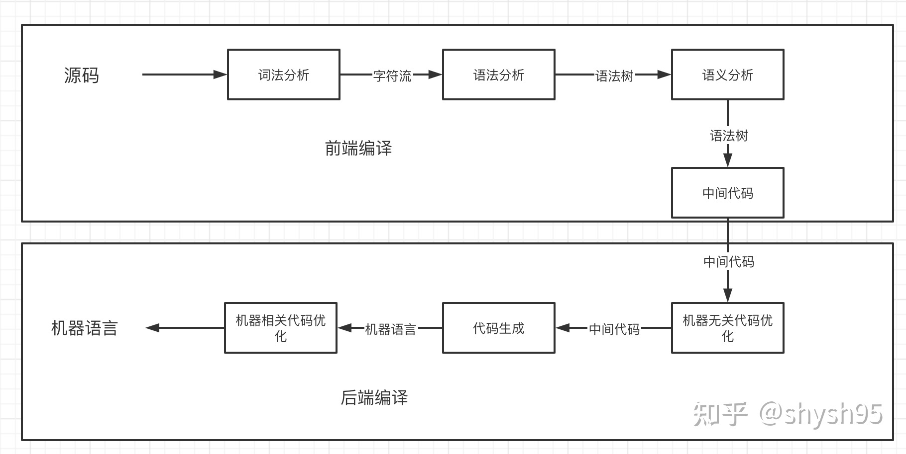
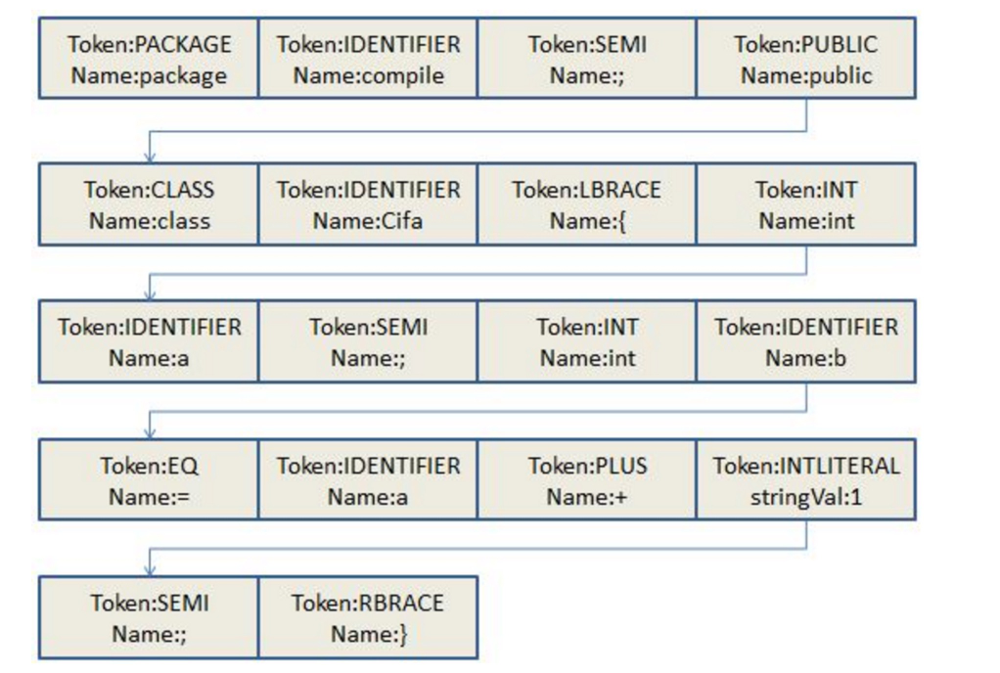
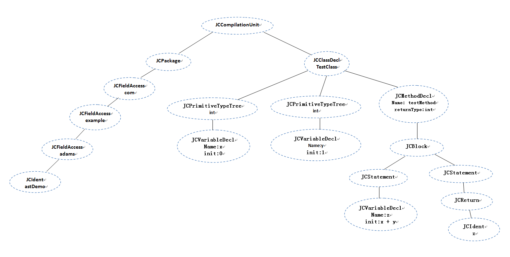

# 一、抽象语法树介绍
CodeQL大部分查询是基于AST语法树的，了解AST可以帮助我们理解和编写CodeQL查询语句。

Java中的编译分为两个部分：
1. 前端编译：源码文件（.java）编译成字节码文件（.class）
2. 后端编译：字节码文件被虚拟机加载以后编译成机器码
流程如图：

## 1.1 词法分析
将源码的字符流解析成符合规范的Token流，规范化的Token可以分成以下三种类型：
1. java关键字：public、static、final、String、int等；
2. 自定义的名称：包名、类名、方法名和变量名；
3. 运算符或者逻辑运算符等符号：+、-、*、/、||、&&等。

例子：

```java
package compile;
public class Cifa {
    int a;
    int c = a + 1;
}
```
以上代码转换为Tokne流如下：


## 1.2 语法分析
根据Token集合生成抽象语法树，语法树是一种表示程序语法结构的表现形式，语法树的每一个节点都代表着程序代码中的一个语法结构，例如包、类型、修饰符。例子：
```java
package com.example.adams.astdemo;
public class TestClass {
    int x = 0;
    int y = 1;
    public int testMethod(){
        int z = x + y;
        return z;
    }
}
```
上面这段代码对应的抽象语法树如图：


# 二、CodeQL中的AST
在CodeQL中，我们可以右击java文件，查看对应的AST，[]中的表示这部分语法结构在QL数据库中的类型，点击AST中的类型会跳转到源文件中对应的代码。


参考链接：
1. [抽象语法树AST的全面解析（一）](https://www.jianshu.com/p/ff8ec920f5b9)
2. [javac编译原理](https://www.cnblogs.com/wade-luffy/p/5925728.html)

# 三、污点追踪技术介绍
污点追踪是CodeQL提供的一个非常强大的功能，也是进行代码审计的基础，CodeQL会分析代码得到一张有向图，参数和表达式就是里面的节点。

了解污点追踪可以帮助我们理解和编写CodeQL查询语句。

污点分析可以抽象成一个三元组<sources,sinks,sanitizers>的形式。
`source`：表示污点源，代表直接引入不受信任的数据或者机密数据到系统中。如从请求中获取的参数。
`sink`：污点汇聚点，代表直接产生安全敏感操作或者泄露隐私数据到外界。如命令执行方法exec()。
`sanitizer`：无害处理，代表通过数据加密或者移除危害操作等手段使数据传播不再对软件系统的信息安全产生危害。如匿名化、参数校验等手段。

污点分析是默认不信任本地/外部输入，将本地及外部输入的控制/数据流过程进行分析，如果没有经过无害化处理，即认为存在漏洞的漏洞模型。

在CodeQL中，常见的查询语句编写思路就是确定source、sink以及
sanitizer，至于source和sink之间能否连通，就交给CodeQL引擎去分析。CodeQL提供了污点分析相关的类和内置谓词，如`TaintTracking::Configuration`、`hasFlowPath`等。

参考链接：
1. [CodeQL从0到1](https://www.freebuf.com/sectool/291433.html)
2. [58集团白盒代码审计系统建设实践2：深入理解SAST
](https://www.freebuf.com/articles/es/269266.html)

# 四、数据流分析
[CodeQL学习——CodeQl数据流分析](https://www.cnblogs.com/goodhacker/p/13583650.html)
